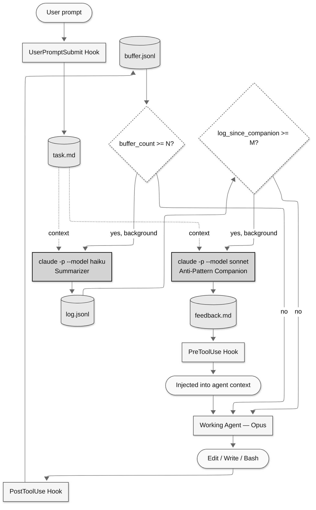

# DevLog: Death Spiral Prevention for Claude Code

> **Based on the work of [Kousha Mazloumi](https://www.linkedin.com/pulse/death-spirals-why-smart-agents-fail-how-make-them-wiser-mazloumi-t7mxe/)** — this project implements the ideas from his article *"Death Spirals: Why Smart Agents Fail and How to Make Them Wiser"*, which identified the core anti-patterns and proposed the meta-cognitive companion architecture.

A hooks-based meta-cognitive companion that detects when a Claude Code agent is stuck in a failing loop and injects interventions to break the cycle.

## The Problem

AI coding agents can enter "death spirals" — locked into a wrong mental model, they make increasingly desperate tactical fixes without ever questioning their strategic frame. A human developer would feel doubt after the 5th failed attempt and step back. The agent has no equivalent reconsideration mechanism.

## How It Works

DevLog is a single Go binary (`devlog`) that runs alongside a working Claude Code agent via hooks. It provides two layers of meta-cognition:

**1. Dev Log** — A compressed narrative memory of what the agent has been doing, continuously updated by Haiku via `claude -p`.

**2. Anti-Pattern Companion** — Sonnet periodically reviews the dev log trajectory and injects interventions into the working agent's context when it detects death spiral patterns.

### Pipeline



The capture hook is synchronous and fast (<200ms). The summarizer and companion run as detached background processes — nothing blocks the working agent.

### Anti-Patterns Detected

| Pattern | Signal |
|---------|--------|
| **Repetition Lock** | N+ consecutive changes to the same file/module with no change in test/error output |
| **Oscillation** | Alternating between two approaches (A→B→A→B) without realizing the loop |
| **Scope Creep Under Failure** | Each attempt touches more files than the last |
| **Mock/Stub Escape** | Creating test doubles that simulate success without solving the real problem |
| **Undo Cycle** | Reverting changes from 2-3 attempts ago |
| **Confidence Escalation** | Repeated claims of "found the root cause" followed by failure |
| **Tangential Resolution** | Fixing something adjacent to the actual problem |

### What an Intervention Looks Like

When the companion detects a spiral, the agent sees this injected into its context on the next tool call:

```
━━━━━━━━━━━━━━━━━━━━━━━━━━━━━━━━━━━━━━━━━━━━━━━━━━━━
[DevLog Companion — Trajectory Assessment]

STATUS: SPIRALING (confidence: 85%)

PATTERN DETECTED: Repetition Lock
You have made 6 consecutive database-layer modifications, none of which
resolved the 500 error on /api/recommendations.

EVIDENCE:
  - Log #3: "Increasing database connection pool from 10 to 25"
  - Log #5: "Rewriting query with explicit index hints"
  - Log #7: "Third consecutive attempt targeting the database layer"

REFRAME: Instead of asking "how do I fix the database timeout", ask
"what are ALL the things that could produce a timeout in this request path?"

ACTION: Re-examine the full stack trace for HTTP calls to external
services that could also produce timeouts.
━━━━━━━━━━━━━━━━━━━━━━━━━━━━━━━━━━━━━━━━━━━━━━━━━━━━
```

## Prerequisites

- **Go 1.21+** (to build)
- **Git** (DevLog tracks code changes via `git diff`)
- **Claude Code CLI** (the summarizer and companion invoke `claude -p` as subprocesses)

## Installation

```bash
# Build the binary
go build -o devlog .

# Move to PATH
mv devlog /usr/local/bin/

# Initialize in your project
cd /path/to/your/project
devlog init

# Install Claude Code hooks
devlog install
```

That's it. DevLog is now monitoring the agent's work.

## OpenCode

DevLog also supports [OpenCode](https://opencode.ai) as an alternative host. `devlog install` auto-detects which host is configured for the project; pass `--host opencode` to force OpenCode when both are present:

```bash
devlog install --host opencode
```

On OpenCode, DevLog writes its plugin shim to `.opencode/plugins/devlog.ts` and registers it in `opencode.json`. The same capture / flush / companion pipeline runs — only the hook surface changes.

> **Deprecation:** the legacy `claude_command` config field is still read for backward compatibility and is transparently migrated to `host_command` on first load. New installs should use `host` and `host_command` instead.

## CLI Reference

| Command | Context | Description |
|---------|---------|-------------|
| `devlog init` | Manual | Initialize `.devlog/`, verify git, set session ID |
| `devlog capture` | PostToolUse hook | Buffer a diff entry; trigger flush if threshold met |
| `devlog task-capture` | UserPromptSubmit hook | Record user's prompt as task/update |
| `devlog task-tool-capture` | PostToolUse hook | Record TaskCreate/TaskUpdate tool calls |
| `devlog check-feedback` | PreToolUse hook | Output pending feedback or exit silently |
| `devlog flush` | Background | Run Haiku summarizer on buffered diffs |
| `devlog companion` | Background / Manual | Run Sonnet anti-pattern assessment |
| `devlog status` | Manual | Show current state: counters, last companion, health |
| `devlog log` | Manual | Print the dev log narrative |
| `devlog reset` | Manual | Clear all state for a fresh session |
| `devlog config [key] [value]` | Manual | Get/set tunable parameters |
| `devlog install` | Manual | Install hooks into Claude Code settings.json |
| `devlog uninstall` | Manual | Remove hooks from Claude Code settings.json |

## Configuration

All parameters are tunable via `devlog config`:

| Parameter | Default | Description |
|-----------|---------|-------------|
| `buffer_size` | 10 | Diffs before triggering summarizer |
| `companion_interval` | 5 | Log entries before triggering companion |
| `summarizer_model` | `claude-haiku-4-5-20251001` | Model for dev log summarization |
| `companion_model` | `claude-sonnet-4-6` | Model for anti-pattern detection |
| `host` | `claude` | Host backend: `claude` or `opencode` |
| `host_command` | `claude` | Path to the host CLI binary |
| `enabled` | true | Master on/off switch |
| `max_diff_chars` | 2000 | Max chars per diff entry in buffer |
| `max_detail_chars` | 200 | Max chars for Edit old/new string summaries |
| `summarizer_timeout_seconds` | 60 | Timeout for Haiku summarizer |
| `companion_timeout_seconds` | 120 | Timeout for Sonnet companion |

## File Structure

```
$PROJECT/.devlog/
├── state.json              # Session state and counters
├── config.json             # Tunable parameters
├── task.md                 # Original task/goal (first user message)
├── task_updates.jsonl      # Subsequent user messages
├── tasks.jsonl             # Claude Code TaskCreate/TaskUpdate captures
├── buffer.jsonl            # Current diff buffer (cleared on flush)
├── buffer_archive.jsonl    # Archived diffs (for companion context)
├── log.jsonl               # Dev log entries (summarized narratives)
├── feedback.md             # Current unread companion feedback
├── feedback_archive.jsonl  # Historical feedback entries
└── errors.log              # All non-fatal errors
```

## Design Decisions

**Why hooks, not MCP?** An agent in a death spiral won't voluntarily call a tool for help. Hooks push feedback into the agent's context automatically — involuntary reconsideration.

**Why Go?** Fast startup is critical for hooks that fire on every tool call. Single binary distribution. Strong concurrency primitives for background process management.

**Why two models?** The summarizer runs frequently (~every 10 edits) and does simple work — Haiku is fast and cheap. The companion runs less often (~every 50 edits) and reasons about complex trajectory patterns — Sonnet is necessary for that judgment quality.

**Why background execution?** The summarizer and companion must not block the working agent. The capture hook appends to a file (<200ms), then spawns background processes.

**Why `git diff` for Bash capture?** Edit/Write hooks know exactly what changed (tool arguments). Bash commands might change files as a side effect. `git diff HEAD` catches those.

## Development

```bash
# Run all tests
go test ./...

# Run with E2E integration test
go test -tags=e2e ./...

# Run with race detector
go test -race ./...

# Check formatting
gofmt -l .
```
