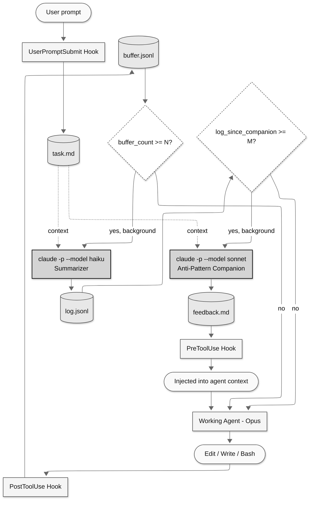

# DevLog: Death Spiral Prevention System for Claude Code

## Problem

AI coding agents can fail catastrophically on long or difficult tasks through "death spirals" — locked into a wrong mental model, they make increasingly desperate tactical fixes without ever questioning their strategic frame. A human developer would feel doubt after the 5th failed attempt and step back. The agent has no equivalent reconsideration mechanism.

## Solution

A hooks-based system that runs alongside the working Claude Code agent, providing two layers of meta-cognition:

1. **Dev Log** — a compressed narrative memory of what the agent has been doing, continuously updated by Haiku via `claude -p`
2. **Anti-Pattern Companion** — Sonnet periodically reviews the dev log trajectory and injects interventions into the working agent's context when it detects death spiral patterns

The entire system is a Go CLI binary (`devlog`) invoked by Claude Code hooks. No MCP server. No polling. Feedback is pushed into the agent's conversation automatically via hook output.

## Prerequisites

- **Git**: Required. The `devlog` binary checks for a git repository on startup (`devlog init`). If git is not initialized, it exits with a clear, actionable error:
  ```
  devlog: error: no git repository found at /path/to/project
  
  DevLog requires git to track code changes. Initialize a repository:
  
      cd /path/to/project && git init
  
  Then re-run: devlog init
  ```
- **Claude Code CLI**: Required. The summarizer and companion invoke `claude -p --model <model>` as subprocesses.

## Architecture



## Hook Input Contract

All Claude Code hooks receive JSON on stdin. The `devlog` binary reads and parses this.

**All hooks receive**:
```json
{
  "session_id": "abc123",
  "transcript_path": "/Users/x/.claude/projects/<hash>/<session>.jsonl",
  "cwd": "/path/to/project"
}
```

**PreToolUse / PostToolUse additionally receive**:
```json
{
  "tool_name": "Edit",
  "tool_input": { "file_path": "...", "old_string": "...", "new_string": "..." }
}
```

**UserPromptSubmit receives**:
```json
{
  "prompt": "Fix the 500 error on /api/recommendations"
}
```

## Components

### 1. Task Capture (UserPromptSubmit Hook)

**Trigger**: Fires on every user message.

**Behavior**:
- On first invocation per session: writes the user's prompt to `$DEVLOG_DIR/task.md` as the original task/goal
- On subsequent invocations: appends to `$DEVLOG_DIR/task_updates.jsonl` with timestamp — these represent course corrections or new instructions from the user
- Also captures task-related tool calls: a PostToolUse hook on `TaskCreate` and `TaskUpdate` appends the task details to `$DEVLOG_DIR/tasks.jsonl`

**Error handling**:
```
devlog: error: failed to write task file at .devlog/task.md: permission denied

Check that .devlog/ exists and is writable. Re-run: devlog init
```

### 2. Diff Capture (PostToolUse Hook)

**Trigger**: Fires after every `Edit`, `Write`, or `Bash` tool call.

**Behavior**:
- Reads hook input JSON from stdin to extract `tool_name` and `tool_input`
- For **Edit**: records file_path, a truncated summary of old_string→new_string (first 200 chars each), timestamp
- For **Write**: records file_path, content length, timestamp
- For **Bash**: runs `git diff --stat HEAD` to detect if working tree changed; if changed, captures `git diff HEAD` (truncated to 2000 chars). If no change, records the command but marks `"changed": false`
- Appends a structured entry to `$DEVLOG_DIR/buffer.jsonl`
- Increments `buffer_count` in `$DEVLOG_DIR/state.json`
- If `buffer_count >= buffer_size` (default: 10): spawns summarizer in background (`devlog flush &`), resets counter

**Buffer entry format**:
```json
{
  "seq": 42,
  "ts": "2026-04-22T22:15:00Z",
  "session_id": "abc123",
  "tool": "Edit",
  "file": "src/api/handler.go",
  "detail": "old: 'Timeout: 30 * time.Second' → new: 'Timeout: 60 * time.Second'",
  "diff_lines": 4,
  "changed": true
}
```

**Performance**: The capture itself must complete in <200ms (file append + stat check). The summarizer is spawned as a background process.

**Error handling**:
```
devlog: error: git diff failed (exit code 129) in /path/to/project

This usually means the git repository is corrupted or a git operation is in progress.
Check: git status

Diff capture skipped for this tool call. DevLog will resume on next call.
```

All errors in the capture hook are non-fatal — the hook logs the error to `$DEVLOG_DIR/errors.log` and exits 0 so the working agent is never blocked.

### 3. Dev Log Summarizer (Haiku)

**Trigger**: Called by `devlog flush`, which is spawned in background by the capture hook when buffer reaches N entries.

**Invocation**:
```bash
claude -p "$PROMPT" \
  --model claude-haiku-4-5-20251001 \
  --output-format json \
  --dangerously-skip-permissions \
  --max-turns 1
```

**Prompt construction** — the Go binary builds the prompt from:
1. The N buffered diff entries (from buffer.jsonl)
2. The last 5 dev log entries (from log.jsonl) for narrative continuity
3. The original task (from task.md)

**System prompt**:
> You are a dev log writer tracking an AI coding agent's work. Summarize what these code changes are trying to accomplish in 1-2 sentences. Write in present tense, focusing on intent and approach, not individual file changes. Your summary should read as the next paragraph in an ongoing narrative. Note any repeated patterns (same files touched, same approach retried).

**Output**: Parsed from JSON response, appended to `log.jsonl`:
```json
{
  "seq": 7,
  "ts": "2026-04-22T22:15:30Z",
  "session_id": "abc123",
  "covers_seqs": [33, 42],
  "summary": "Systematically increasing database timeouts and connection pool sizes to resolve a 500 error on /api/recommendations. Third consecutive attempt targeting the database layer.",
  "model": "claude-haiku-4-5-20251001",
  "duration_ms": 1200
}
```

**After flushing**: Moves buffer.jsonl entries to buffer_archive.jsonl, clears buffer.jsonl, increments `log_count` and `log_since_companion` in state.json. If `log_since_companion >= companion_interval`: spawns companion in background (`devlog companion &`), resets that counter.

**Error handling**:
```
devlog: error: summarizer failed: claude exited with code 1

stderr: Error: model "claude-haiku-4-5-20251001" not available

Check your Claude Code subscription supports the haiku model.
Buffer preserved — will retry on next flush. Run 'devlog flush' to retry manually.

Full error logged to: .devlog/errors.log
```

On summarizer failure, the buffer is NOT cleared. The next flush will include these entries plus any new ones.

### 4. Anti-Pattern Companion (Sonnet)

**Trigger**: Called by `devlog companion`, spawned in background by the summarizer when the dev log accumulates M entries since last check (default: 5). Also callable manually.

**Invocation**:
```bash
claude -p "$PROMPT" \
  --model claude-sonnet-4-6 \
  --output-format json \
  --dangerously-skip-permissions \
  --max-turns 1
```

**Prompt construction** — the Go binary builds the prompt from:
1. The original task (from task.md)
2. Any user course corrections (from task_updates.jsonl)
3. The last 25 dev log entries (from log.jsonl)
4. The last 50 raw buffer entries (from buffer_archive.jsonl)
5. Claude Code task list entries if present (from tasks.jsonl)

**System prompt**:
> You are a meta-cognitive companion monitoring an AI coding agent's work trajectory. Your job is to detect "death spiral" anti-patterns — situations where the agent is locked into a wrong mental model and making increasingly desperate tactical fixes without questioning its strategic frame.
>
> You have access to:
> - ORIGINAL TASK: What the user asked the agent to do
> - USER UPDATES: Any course corrections the user has given
> - DEV LOG: A compressed narrative of the agent's actions over time
> - RAW DIFFS: Recent code changes for detail
> - TASK LIST: The agent's own task breakdown (if it created one)
>
> Assess whether the agent is:
> 1. **ON_TRACK** — making coherent progress toward the goal
> 2. **DRIFTING** — minor concerns worth noting (no intervention yet)
> 3. **SPIRALING** — locked in a wrong frame, needs immediate intervention
>
> Anti-patterns to detect:
> - **Repetition Lock**: N+ consecutive changes to the same file/module without the test/error changing
> - **Oscillation**: Alternating between two approaches (A→B→A→B) without realizing the loop
> - **Scope Creep Under Failure**: Each attempt touches more files than the last, broadening instead of deepening understanding
> - **Mock/Stub Escape**: Creating test doubles, stubs, or mocks that simulate success without solving the real problem
> - **Undo Cycle**: Reverting changes from 2-3 attempts ago, indicating loss of working memory
> - **Confidence Escalation**: Repeated claims of "found the root cause" / "this will definitely fix it" followed by failure
> - **Tangential Resolution**: Fixing something adjacent to the actual problem to claim success
>
> If status is SPIRALING, your intervention MUST:
> 1. Name the specific anti-pattern you detected
> 2. Cite evidence from the dev log (quote the relevant entries)
> 3. Identify the assumption the agent should question
> 4. Suggest a concrete reframe — a different question to ask or approach to try

**Output format** (validated via --json-schema in future):
```json
{
  "status": "spiraling",
  "confidence": 0.85,
  "pattern": "repetition_lock",
  "evidence": [
    "Log #3: 'Increasing database connection pool from 10 to 25'",
    "Log #5: 'Rewriting query with explicit index hints'",
    "Log #7: 'Third consecutive attempt targeting the database layer'"
  ],
  "summary": "Agent has made 6 consecutive database-layer modifications targeting timeout behavior, none resolving the 500 error.",
  "intervention": "STOP. You've made 6 database-related changes and the error is unchanged. The timeout may not be database-related. Re-examine the full stack trace — look for HTTP calls to external services that could also produce timeouts. The /api/recommendations endpoint may depend on a third-party service whose API key or URL is misconfigured.",
  "reframe": "Instead of asking 'how do I fix the database timeout', ask 'what are ALL the things that could produce a timeout in this request path?'"
}
```

**After assessment**: Writes result to state.json `last_companion` field. If status is `DRIFTING` or `SPIRALING`, formats a human-readable intervention message and writes it to `feedback.md`.

**Error handling**:
```
devlog: error: companion failed: claude process timed out after 120s

The anti-pattern companion took too long to respond. This can happen with very large
dev logs. Try reducing companion_log_entries in .devlog/config.json.

Assessment skipped. Will retry after next 5 log entries.
Run 'devlog companion' to retry manually.

Full error logged to: .devlog/errors.log
```

### 5. Feedback Injection (PreToolUse Hook)

**Trigger**: Fires before every tool call the working agent makes.

**Behavior**:
- Checks if `$DEVLOG_DIR/feedback.md` exists and has content (file stat + size check)
- If empty or missing: exits silently with code 0, no stdout (no delay to agent)
- If content found:
  1. Reads the feedback content
  2. Outputs it to stdout (Claude Code injects this into the agent's context)
  3. Archives to `feedback_archive.jsonl` with timestamp
  4. Truncates `feedback.md` to empty

**What the agent sees** (formatted by the Go binary from the companion's JSON):
```
━━━━━━━━━━━━━━━━━━━━━━━━━━━━━━━━━━━━━━━━━━━━━━━━━━━━
[DevLog Companion — Trajectory Assessment]

STATUS: SPIRALING (confidence: 85%)

PATTERN DETECTED: Repetition Lock
You have made 6 consecutive database-layer modifications, none of which
resolved the 500 error on /api/recommendations.

EVIDENCE:
  - Log #3: "Increasing database connection pool from 10 to 25"
  - Log #5: "Rewriting query with explicit index hints"
  - Log #7: "Third consecutive attempt targeting the database layer"

REFRAME: Instead of asking "how do I fix the database timeout", ask
"what are ALL the things that could produce a timeout in this request path?"

ACTION: Re-examine the full stack trace for HTTP calls to external
services that could also produce timeouts.
━━━━━━━━━━━━━━━━━━━━━━━━━━━━━━━━━━━━━━━━━━━━━━━━━━━━
```

**Performance**: Must complete in <50ms (stat check + file read + truncate). This hook fires on EVERY tool call so it must be near-instant.

**Error handling**: All errors are silent (exit 0, no stdout). A broken feedback hook must never block the working agent. Errors logged to `$DEVLOG_DIR/errors.log`.

## File Structure

```
$PROJECT/.devlog/
├── state.json              # Session state, counters, last companion result
├── config.json             # Tunable parameters (overrides defaults)
├── task.md                 # Original task/goal (first user message)
├── task_updates.jsonl      # Subsequent user messages (course corrections)
├── tasks.jsonl             # Claude Code TaskCreate/TaskUpdate captures
├── buffer.jsonl            # Current diff buffer (cleared on flush)
├── buffer_archive.jsonl    # Archived diffs (for companion context)
├── log.jsonl               # Dev log entries (summarized narratives)
├── feedback.md             # Current unread companion feedback
├── feedback_archive.jsonl  # Historical feedback entries
└── errors.log              # All non-fatal errors from all components
```

**state.json structure**:
```json
{
  "session_id": "abc123",
  "started_at": "2026-04-22T22:00:00Z",
  "buffer_count": 3,
  "buffer_seq": 45,
  "log_count": 8,
  "log_seq": 8,
  "log_since_companion": 3,
  "last_companion": {
    "ts": "2026-04-22T22:14:00Z",
    "status": "on_track",
    "confidence": 0.92
  },
  "flush_in_progress": false,
  "companion_in_progress": false
}
```

## Configuration

### Tunable Parameters (config.json)

| Parameter | Default | Description |
|-----------|---------|-------------|
| `buffer_size` | 10 | Diffs before triggering summarizer |
| `companion_interval` | 5 | Log entries before triggering companion |
| `summarizer_model` | `claude-haiku-4-5-20251001` | Model for dev log summarization |
| `companion_model` | `claude-sonnet-4-6` | Model for anti-pattern detection |
| `summarizer_context_entries` | 5 | Prior log entries included in summarizer prompt |
| `companion_log_entries` | 25 | Log entries included in companion prompt |
| `companion_diff_entries` | 50 | Archived diffs included in companion prompt |
| `enabled` | true | Master on/off switch |
| `max_diff_chars` | 2000 | Max chars per diff entry in buffer |
| `max_detail_chars` | 200 | Max chars for Edit old/new string summaries |
| `claude_command` | `claude` | Path to claude CLI binary |
| `summarizer_timeout_seconds` | 60 | Timeout for haiku summarizer |
| `companion_timeout_seconds` | 120 | Timeout for sonnet companion |

### Hook Configuration (Claude Code settings.json)

```json
{
  "hooks": {
    "UserPromptSubmit": [
      {
        "matcher": "",
        "command": "devlog task-capture"
      }
    ],
    "PostToolUse": [
      {
        "matcher": "Edit|Write|Bash",
        "command": "devlog capture"
      },
      {
        "matcher": "TaskCreate|TaskUpdate",
        "command": "devlog task-tool-capture"
      }
    ],
    "PreToolUse": [
      {
        "matcher": ".*",
        "command": "devlog check-feedback"
      }
    ]
  }
}
```

## CLI Commands

The `devlog` binary is written in Go. All subcommands read JSON from stdin when invoked as hooks, or operate standalone for manual use.

| Command | Hook Context | Description |
|---------|-------------|-------------|
| `devlog init` | Manual / SessionStart | Initialize .devlog/, verify git, set session ID |
| `devlog capture` | PostToolUse | Buffer a diff entry; trigger flush if threshold met |
| `devlog task-capture` | UserPromptSubmit | Record user's prompt as task/update |
| `devlog task-tool-capture` | PostToolUse | Record TaskCreate/TaskUpdate tool calls |
| `devlog check-feedback` | PreToolUse | Output pending feedback or exit silently |
| `devlog flush` | Background | Run Haiku summarizer on buffered diffs |
| `devlog companion` | Background / Manual | Run Sonnet anti-pattern assessment |
| `devlog status` | Manual | Show current state: counters, last companion, health |
| `devlog log` | Manual | Print the dev log narrative (human-readable) |
| `devlog reset` | Manual | Clear all state for a fresh session |
| `devlog config [key] [value]` | Manual | Get/set tunable parameters |
| `devlog install` | Manual | Install hooks into Claude Code settings.json |
| `devlog uninstall` | Manual | Remove hooks from Claude Code settings.json |

### Error Message Philosophy

Every error message from `devlog` follows this structure:

1. **What failed**: `devlog: error: <component>: <what happened>`
2. **Why it matters**: One sentence on the impact
3. **What to do**: Concrete fix command or investigation step
4. **Where to look**: Path to errors.log or relevant file

Examples:
```
devlog: error: init: no git repository found at /Users/x/project

DevLog requires git to track code changes.
To fix: cd /Users/x/project && git init
Then retry: devlog init
```

```
devlog: error: capture: failed to parse hook input from stdin

Expected JSON with 'tool_name' and 'tool_input' fields.
Got: <first 100 chars of actual input>

This may indicate a Claude Code version incompatibility.
Check Claude Code version: claude --version
DevLog requires Claude Code >= 2.1.0

Error logged to: /Users/x/project/.devlog/errors.log
```

```
devlog: error: flush: summarizer returned empty response

Haiku was invoked but returned no usable summary.
Prompt size: 4,231 chars | Model: claude-haiku-4-5-20251001

Buffer preserved (7 entries). Will retry on next flush.
To retry now: devlog flush
To inspect the prompt: devlog flush --dry-run

Error logged to: /Users/x/project/.devlog/errors.log
```

```
devlog: error: companion: claude command not found

The 'claude' CLI is not in PATH. DevLog needs it to run the
summarizer and companion models.

Install: https://docs.anthropic.com/en/docs/claude-code
Or set path: devlog config claude_command /path/to/claude

Error logged to: /Users/x/project/.devlog/errors.log
```

## Session Lifecycle

### Start
1. User runs `devlog init` (or it runs via SessionStart hook)
2. Binary checks: git repo? claude in PATH? .devlog/ writable?
3. Creates .devlog/ directory structure if needed
4. Generates session ID, writes initial state.json
5. First `UserPromptSubmit` hook captures the task to task.md

### During Work
1. PostToolUse hooks fire automatically on Edit/Write/Bash
2. Diffs accumulate in buffer.jsonl (synchronous, <200ms)
3. At buffer_size threshold, `devlog flush` spawns in background
4. Haiku summarizes, appends to log.jsonl
5. At companion_interval threshold, `devlog companion` spawns in background
6. Sonnet assesses trajectory, writes to feedback.md if intervention needed
7. Next PreToolUse hook picks up feedback.md and injects it into agent context

### End
State persists in .devlog/. On next `devlog init`, previous log entries remain available for cross-session context (companion can reference them).

## Anti-Pattern Detection Heuristics

The companion prompt encodes these specific patterns (expandable over time):

| # | Pattern | Signal |
|---|---------|--------|
| 1 | **Repetition Lock** | N+ consecutive changes to the same file/module with no change in test/error output |
| 2 | **Oscillation** | Alternating between two approaches (A→B→A→B) without realizing the loop |
| 3 | **Scope Creep Under Failure** | Each attempt touches more files than the last, broadening instead of deepening |
| 4 | **Mock/Stub Escape** | Creating test doubles or stubs that simulate success without solving the real problem |
| 5 | **Undo Cycle** | Reverting changes from 2-3 attempts ago, indicating loss of working memory |
| 6 | **Confidence Escalation** | Repeated claims of "found the root cause" followed by failure |
| 7 | **Tangential Resolution** | Fixing something adjacent to the actual problem to claim success |

## Go Project Structure

```
devlog/
├── SPEC.md
├── CLAUDE.md
├── go.mod
├── go.sum
├── main.go                     # CLI entry point, subcommand dispatch
├── cmd/
│   ├── init.go                 # devlog init
│   ├── capture.go              # devlog capture (PostToolUse hook)
│   ├── task_capture.go         # devlog task-capture (UserPromptSubmit hook)
│   ├── task_tool_capture.go    # devlog task-tool-capture (PostToolUse on Task*)
│   ├── check_feedback.go       # devlog check-feedback (PreToolUse hook)
│   ├── flush.go                # devlog flush (Haiku summarizer)
│   ├── companion.go            # devlog companion (Sonnet anti-pattern)
│   ├── status.go               # devlog status
│   ├── log.go                  # devlog log
│   ├── reset.go                # devlog reset
│   ├── config.go               # devlog config
│   ├── install.go              # devlog install (hook setup)
│   └── uninstall.go            # devlog uninstall (hook removal)
├── internal/
│   ├── state/
│   │   ├── state.go            # state.json read/write with file locking
│   │   └── config.go           # config.json with defaults
│   ├── buffer/
│   │   ├── buffer.go           # buffer.jsonl append/read/archive/clear
│   │   └── entry.go            # buffer entry types
│   ├── devlog/
│   │   ├── log.go              # log.jsonl append/read
│   │   └── entry.go            # log entry types
│   ├── hook/
│   │   ├── input.go            # Parse hook JSON from stdin
│   │   └── output.go           # Format feedback output for hook stdout
│   ├── claude/
│   │   ├── runner.go           # Invoke claude -p with model/flags
│   │   └── parser.go           # Parse claude JSON output
│   ├── git/
│   │   ├── diff.go             # git diff capture
│   │   └── check.go            # git repo validation
│   ├── feedback/
│   │   ├── writer.go           # Write feedback.md from companion result
│   │   ├── reader.go           # Read + truncate feedback.md
│   │   └── formatter.go        # Format companion JSON into readable text
│   ├── prompt/
│   │   ├── summarizer.go       # Build Haiku summarizer prompt
│   │   └── companion.go        # Build Sonnet companion prompt
│   └── errors/
│       └── errors.go           # Structured error types with context
└── internal/testutil/
    └── fixtures.go             # Shared test fixtures
```

## Implementation Plan

### Phase 1: Skeleton + Capture Pipeline
- [ ] Go module init, CLI framework (cobra or bare flag parsing)
- [ ] `devlog init` — git check, directory creation, state.json
- [ ] Hook input parser (read JSON from stdin)
- [ ] `devlog capture` — buffer.jsonl append for Edit/Write/Bash
- [ ] `devlog task-capture` — task.md write from UserPromptSubmit
- [ ] `devlog check-feedback` — feedback.md read/output/truncate
- [ ] State management with file locking
- [ ] Error infrastructure (structured errors, errors.log)
- [ ] `devlog install` / `devlog uninstall` — hook config management
- [ ] Tests for all of the above

### Phase 2: Summarizer + Companion
- [ ] Claude runner (invoke `claude -p` as subprocess, parse output)
- [ ] `devlog flush` — build Haiku prompt, invoke, parse, append to log.jsonl
- [ ] Buffer archival after flush
- [ ] `devlog companion` — build Sonnet prompt, invoke, parse, write feedback
- [ ] Feedback formatter (JSON → human-readable intervention message)
- [ ] Background process spawning from hooks (flush & companion)
- [ ] Concurrency guards (flush_in_progress, companion_in_progress in state)
- [ ] Tests for all of the above

### Phase 3: Manual Commands + Polish
- [ ] `devlog status` — human-readable state summary
- [ ] `devlog log` — formatted dev log narrative
- [ ] `devlog reset` — clear state with confirmation
- [ ] `devlog config` — get/set with validation
- [ ] `devlog flush --dry-run` — show prompt without invoking
- [ ] `devlog companion --dry-run` — show prompt without invoking
- [ ] Cross-session context carryover
- [ ] End-to-end integration tests

## Design Decisions & Rationale

**Why hooks, not MCP?** Hooks push feedback into the agent's context automatically. An MCP tool requires the agent to decide to call it — but an agent in a death spiral won't know to ask for help. The whole point is involuntary reconsideration.

**Why Go?** Fast startup (critical for hooks that fire on every tool call), single binary distribution, strong concurrency primitives for background process management, good JSON handling, and matches the adversarial_spec_system codebase the team already maintains.

**Why two models?** The summarizer runs frequently (every ~10 edits) and does simple work — Haiku is fast. The companion runs less often (~every 50 edits) and reasons about complex trajectory patterns — Sonnet is necessary for that judgment quality.

**Why background execution?** The summarizer and companion must not block the working agent. The capture hook itself just appends to a file (<200ms), then spawns background processes.

**Why `git diff` for Bash capture?** Edit/Write hooks know exactly what changed (tool arguments). Bash commands might change files as a side effect. `git diff HEAD` catches those.

**Why PreToolUse for feedback injection?** It fires before the agent's next action, giving it the intervention before it commits to another attempt. PostToolUse would be too late — the action already happened.

**Why transcript_path matters**: The companion could also read the raw Claude Code transcript for richer context (the agent's reasoning, not just its actions). This is a future enhancement — the dev log narrative is sufficient for MVP.
